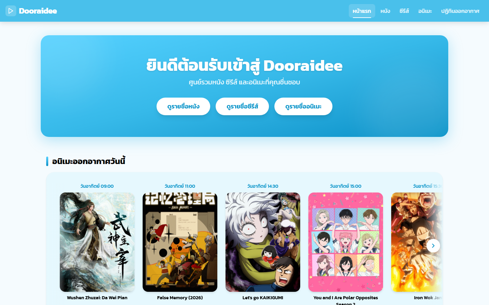
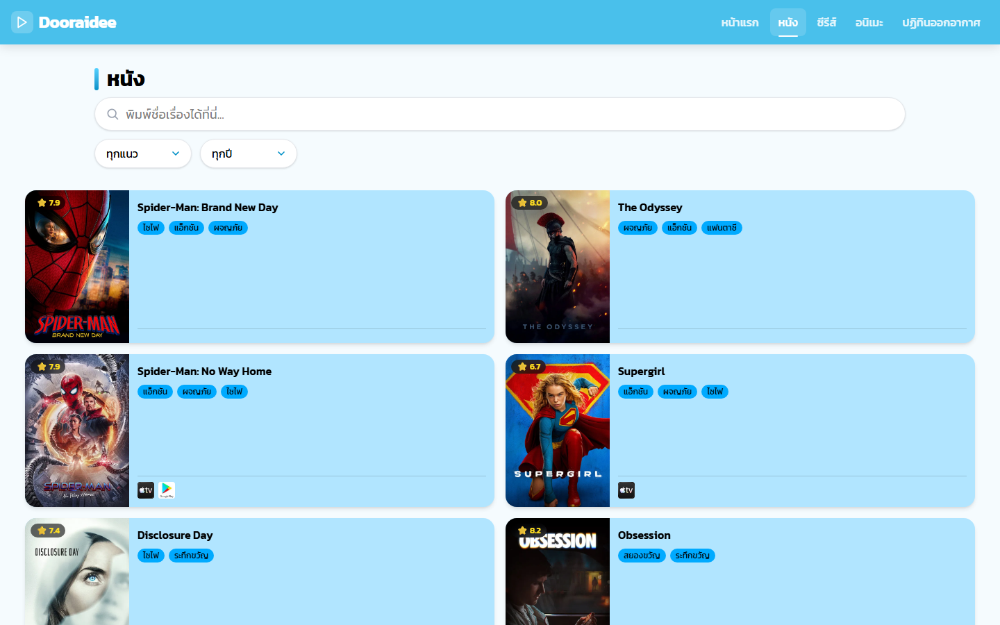
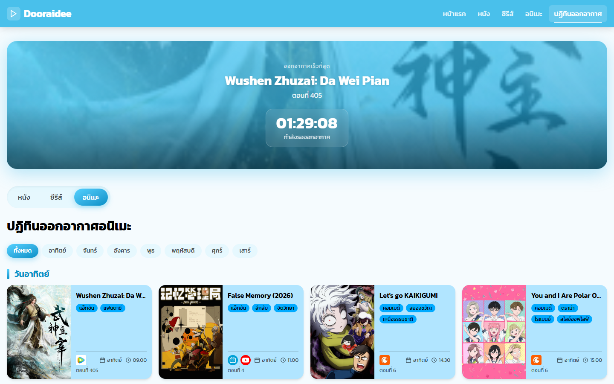
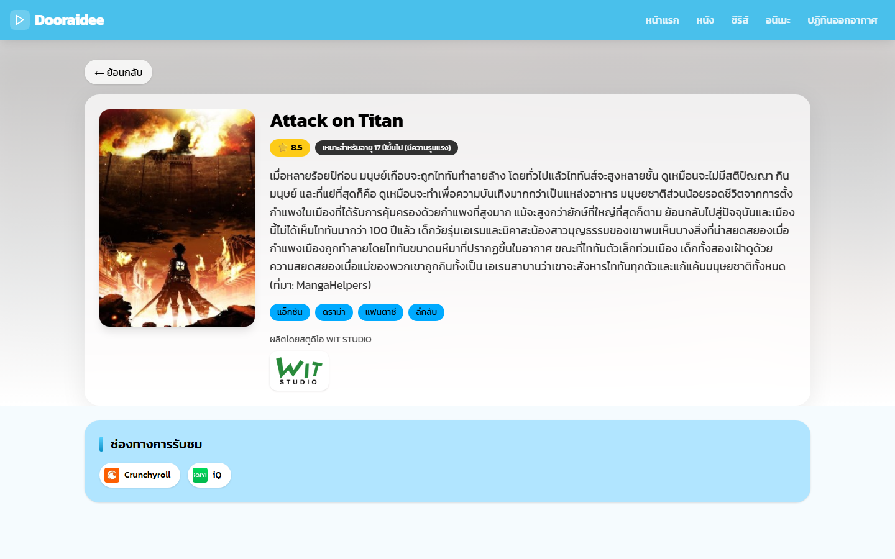

# Dooraidee

Dooraidee (ดูไรดี) คือเว็บรวบรวมข้อมูลหนัง ซีรีส์ และอนิเมะภาษาไทย ดึงข้อมูลจาก TMDB, AniList และ MyAnimeList มาแปลงให้อยู่ในรูปแบบเดียวกัน แล้วแสดงช่องทางที่ดูได้จริงในประเทศไทย พร้อมปฏิทินออกอากาศที่มีตัวนับถอยหลังแบบเรียลไทม์สำหรับอนิเมะที่กำลังฉายอยู่

โปรเจกต์ full-stack: React (Vite) ฝั่งหน้าบ้าน + Express ฝั่งหลังบ้าน รองรับการใช้งานทั้งบนเดสก์ท็อป แท็บเล็ต และมือถือ

**เว็บตัวอย่าง**: [dooraidee-iota.vercel.app](https://dooraidee-iota.vercel.app/)

## ภาพตัวอย่าง

| หน้าแรก | หนัง |
|---|---|
|  |  |

| ปฏิทินออกอากาศ | หน้ารายละเอียด |
|---|---|
|  |  |

## ฟีเจอร์

- **เรียกดูและค้นหา** หนัง ซีรีส์ และอนิเมะ พร้อมแบ่งหน้าแบบ server-side, กรองตามแนว/ฤดูกาล/ปี ด้วย dropdown ที่ออกแบบเอง (ไม่ใช่ browser default) และรายชื่อแนวตรงตามจริงของแต่ละหมวด (หนัง/ซีรีส์/อนิเมะ มีชุดแนวไม่เหมือนกัน)
- **ค้นหาด้วยชื่อภาษาต้นฉบับ** — หนัง/ซีรีส์ค้นด้วยชื่อภาษาต้นฉบับได้อยู่แล้วผ่าน TMDB ส่วนอนิเมะ AniList ไม่รองรับการค้นด้วยชื่อญี่ปุ่น เลยเสริม fallback ไปค้นที่ MyAnimeList แทนแล้วโยงกลับมาเป็นข้อมูล AniList ผ่าน MAL ID
- **จำนวนหน้าที่แม่นยำสำหรับอนิเมะ** — AniList ไม่คืนค่าจำนวนรวมที่แม่นยำสำหรับการค้นหาแบบกรอง (ค่าที่ได้ถูกจำกัดไว้ที่ 5000 เสมอไม่ว่าจะกรองแค่ไหน) เลยให้ backend ทำ binary search หาหน้าสุดท้ายจริงๆ แล้ว cache ผลลัพธ์ไว้ต่อชุดตัวกรอง หากขั้นตอนนี้ล้มเหลว (เช่นโดนจำกัดอัตราเรียก API) จะ fallback ไปใช้ค่าประมาณแทนที่จะทำให้ทั้งหน้าพัง — ผลลัพธ์จริงที่ดึงมาได้แล้วยังคงแสดงเสมอ
- **เอาเฉพาะเรื่องที่ฉายแล้วจริง** — หนัง/ซีรีส์/อนิเมะที่ยังไม่ถึงวันฉายจะไม่ถูกนำมาแสดงในหน้ารายการ (กรองที่ระดับ query ของ AniList/TMDB โดยตรงเมื่อทำได้ และกรองซ้ำฝั่ง backend สำหรับการค้นหาที่ API ต้นทางไม่รองรับพารามิเตอร์นี้)
- **ข้อมูลช่องทางรับชมเฉพาะประเทศไทย** — กรองรายชื่อผู้ให้บริการทั้งจาก TMDB และ AniList ให้เหลือแค่แพลตฟอร์มที่เปิดให้บริการจริงในไทย พร้อม logo จริงและลิงก์ค้นหาตรงไปยังแต่ละแพลตฟอร์ม แทนที่จะใช้ลิงก์รวมแบบเดียว
- **ปฏิทินออกอากาศอนิเมะ** — อนิเมะที่กำลังฉายทุกเรื่องจัดกลุ่มตามวันในสัปดาห์ พร้อมตัวนับถอยหลังไปยังตอนถัดไปแบบเรียลไทม์ กรองดูเฉพาะวันที่สนใจได้ (หรือดูทั้งหมด) แยกแท็บสำหรับหนังเข้าฉายเร็วๆ นี้ และซีรีส์ตอนใหม่
- **เรตติ้งอายุ** ดึงจาก MyAnimeList API ทางการ แสดงผลเป็นภาษาไทย
- **การเชื่อมต่อ AniList ที่ทนทาน** — เพราะ AniList มี rate limit ที่ค่อนข้างเข้มงวด (ประมาณ 30 request/นาที) เลยมีหลายชั้นป้องกัน: dedupe request ที่ยิงพร้อมกัน (ใช้ผลลัพธ์เดียวกันแทนยิงซ้ำ), cache ผลลัพธ์ในหน่วยความจำ (5 นาทีสำหรับรายการ/ค้นหา, 1 ชั่วโมงสำหรับรายละเอียดอนิเมะ), จำกัดอัตรายิง request ออกให้เว้นระยะกัน, retry แบบ backoff เมื่อโดนจำกัดอัตรา และ fallback ไปใช้ข้อมูล cache เก่าแทนการโชว์ error ถ้ายิงใหม่ไม่สำเร็จจริงๆ
- **Responsive** — ใช้งานได้ลื่นทั้งมือถือ แท็บเล็ต และเดสก์ท็อป (เมนูแบบแฮมเบอร์เกอร์บนจอเล็ก, การ์ด/ตัวอักษร/ระยะห่างปรับตามขนาดจอ)
- **การ์ดที่ปรับเนื้อหาตามพื้นที่จริง** — แท็กแนวและไอคอนช่องทางรับชมบนการ์ดแต่ละใบใส่ให้ได้มากที่สุดเท่าที่พื้นที่มี (วัดความกว้างจริงด้วย ResizeObserver) แล้วค่อยย่อเป็น "+N" เมื่อพื้นที่ไม่พอ แทนที่จะจำกัดจำนวนตายตัว
- Loading skeleton, สถานะ error ที่ไม่พังหน้าเว็บ และ UI ภาษาไทยทั้งเว็บ

## Tech stack

| | |
|---|---|
| Frontend | React 19, Vite, React Router, Tailwind CSS 4, Embla Carousel |
| Backend | Node.js, Express 5, Axios |
| แหล่งข้อมูล | [TMDB](https://www.themoviedb.org/), [AniList](https://anilist.co/) GraphQL API, [MyAnimeList](https://myanimelist.net/) API ทางการ |
| Testing | Node built-in test runner (backend), Vitest + React Testing Library (frontend) |

## โครงสร้างโปรเจกต์

```
backend/
  routes/         Express route handlers (movies, tv-shows, anime, calendar, watch-providers)
  services/        เรียก API ภายนอก + แปลงข้อมูลให้เป็นรูปแบบเดียวกัน (anilistService, tmdbService, malService, normalizer)
  config/          ตั้งค่า environment
frontend/
  src/pages/       หน้าเว็บตาม route (Home, Movies, TvShows, Anime, DetailPage, AnimeCalendar)
  src/components/  UI ที่ใช้ซ้ำได้ (MediaCard, MediaGrid, Pagination, FilterBar, ...)
  src/utils/       ฟังก์ชันช่วยเล็กๆ (slugify, ป้ายชื่อแนวภาษาไทย)
```

## เริ่มต้นใช้งาน

### สิ่งที่ต้องมีก่อน

- Node.js 18 ขึ้นไป (built-in test runner ต้องการเวอร์ชันนี้)
- [TMDB API read access token](https://developer.themoviedb.org/docs/getting-started)
- [MyAnimeList API client ID](https://myanimelist.net/apiconfig) (จากแอปที่ลงทะเบียนกับ MAL)

### ติดตั้ง

```bash
# Backend
cd backend
npm install
cp .env.example .env   # แล้วกรอก TMDB / MAL credentials ของตัวเอง
npm start               # รันที่ http://localhost:4000

# Frontend (เปิด terminal อีกหน้าต่าง)
cd frontend
npm install
npm run dev              # รันที่ http://localhost:5173
```

ฝั่ง frontend จะเรียก backend ที่ `http://localhost:4000`

### ตัวแปร environment (`backend/.env`)

| ตัวแปร | คำอธิบาย |
|---|---|
| `PORT` | พอร์ตของ backend (ค่าเริ่มต้น 4000) |
| `TMDB_READ_ACCESS_TOKEN` | TMDB API v4 read access token |
| `MAL_CLIENT_ID` | MyAnimeList API client ID |

## คำสั่งที่ใช้ได้

**backend/**
- `npm start` — รัน API server
- `npm test` — รันเทสของ backend (Node built-in test runner)

**frontend/**
- `npm run dev` — รัน Vite dev server
- `npm run build` — build สำหรับ production
- `npm test` — รันเทสของ frontend (Vitest)
- `npm run lint` — ตรวจโค้ดด้วย ESLint

## การทดสอบ

เทสเน้นไปที่ business logic ล้วนๆ ที่พังแบบเงียบๆ ได้ง่ายที่สุดถ้าไม่มีการทดสอบ: การแปลงข้อมูล, การกรองเนื้อหาสำหรับผู้ใหญ่, การกรองช่องทางรับชมตามประเทศ และการหาจำนวนหน้าด้วย binary search ฝั่ง backend; การแสดงผล pagination และฟังก์ชันช่วยเล็กๆ ฝั่ง frontend ทั้งหมดไม่ได้เรียก API จริงระหว่างเทส

```bash
cd backend && npm test
cd frontend && npm test
```

## การ deploy

เว็บจริงรันอยู่บน **Render** (backend) และ **Vercel** (frontend) — ดู `render.yaml` ที่ root สำหรับ config ของ backend

- **Backend (Render)**: ต้องตั้ง env var `TMDB_READ_ACCESS_TOKEN`, `MAL_CLIENT_ID`, และ `FRONTEND_URL` (origin ของเว็บ frontend ที่ deploy จริง เพื่อจำกัด CORS — ถ้าไม่ตั้งจะเปิดกว้างทุก origin)
- **Frontend (Vercel)**: ตั้ง Root Directory เป็น `frontend`, ตั้ง env var `VITE_API_URL` ชี้ไปที่ URL ของ backend บน Render

## หมายเหตุ

โปรเจกต์นี้ทำขึ้นเพื่อการเรียนรู้ส่วนตัว/portfolio ไม่ได้มีส่วนเกี่ยวข้องกับ TMDB, AniList หรือ MyAnimeList และไม่ได้ออกแบบมาให้พร้อมใช้งานจริงในระดับ production (ไม่มีระบบ auth, ไม่มีการจำกัดอัตราการเรียก API ของตัวเอง, ไม่มีชั้นเก็บข้อมูลถาวร)
